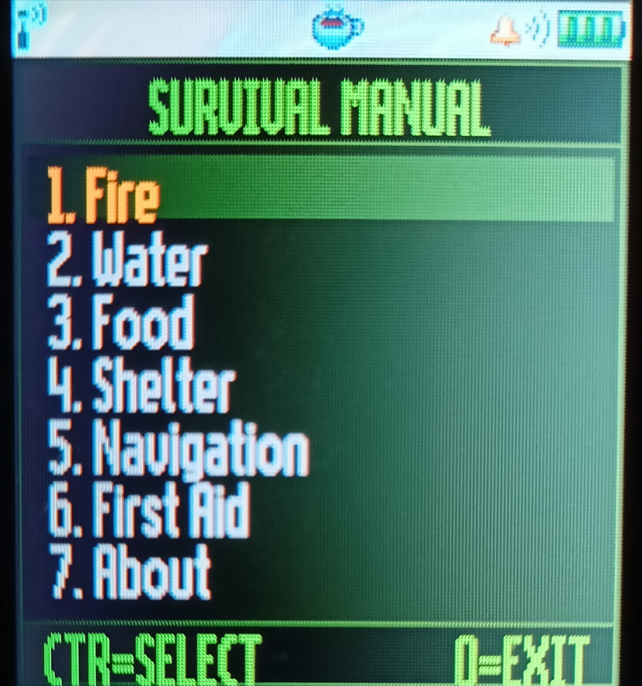
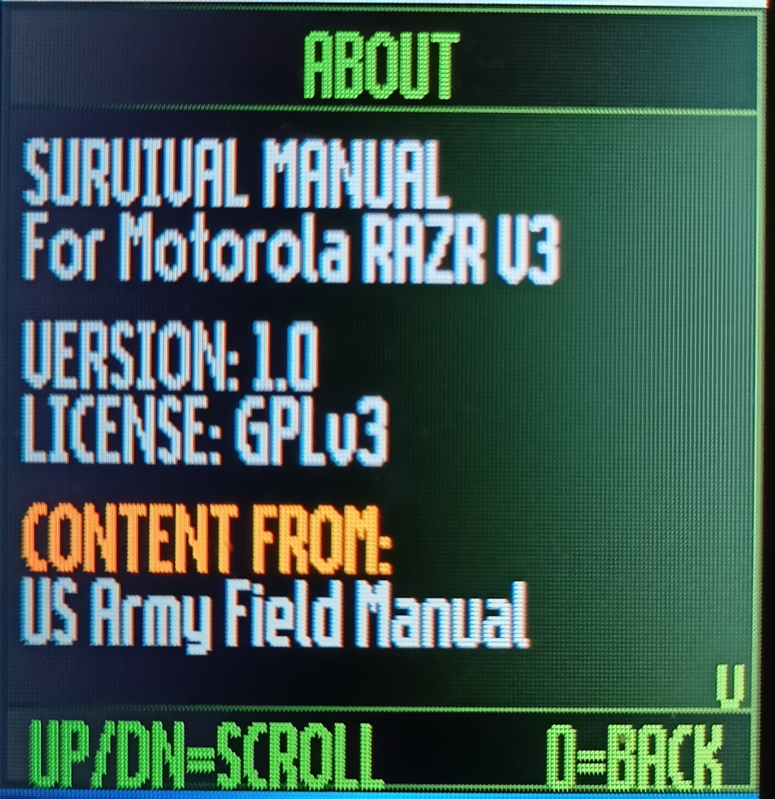

# SurvivalRAZR 

## Screenshots

  
  
  
  

## Description

This is a fully functional survival manual app running on a real 2004 Motorola RAZR V3 phone. No Android, no smartphone, just a 20-year-old flip phone and Java ME.

The app contains survival knowledge from the **US Army Field Manual FM 3-05.70** (public domain), organized into 6 categories with sub-topics and scrollable content.

## Why?

Technology has always pushed us to discover more about the world and about ourselves. So why not? Why not ask questions, try things, and fail forward?

This is a "silly" project on paper: porting a survival app to a 20-year-old flip phone that nobody uses anymore. But what's stopping anyone from doing it? We live in an era where you can build almost anything with the tools available to you. So I took advantage of that.

This started as a summer project out of curiosity. It turned into a working app, running on real hardware from 2004, built step by step from scratch.

## Features

- 🟢 Military green custom UI built with J2ME Canvas
- 📋 6 survival categories with sub-menus
- 🔴 Color-coded content (warnings in red, tips in yellow)
- 📜 Scrollable content screens
- ⌨️ Full D-pad navigation
- 📴 100% offline — no internet needed

## Categories

1. **Fire** — Principles, Site Selection, Materials, Building, Lighting
2. **Water** — Sources, Solar Still, Purification, Filtration
3. **Food** — Animals, Traps, Fishing, Plants, Cooking
4. **Shelter** — Site Selection, Types, Desert, Cold Weather
5. **Navigation** — Sun, Stars, Shadow Method, Map & Compass
6. **First Aid** — Lifesaving Steps, Fractures, Bites, Wounds, Heat & Cold

## Controls

| Key | Action |
|-----|--------|
| D-pad Up/Down | Navigate menu |
| D-pad Center | Select |
| 0 | Back / Exit |

## How to Build

1. Install [Java 8 (Temurin)](https://adoptium.net)
2. Install [Sun Java Wireless Toolkit 2.5.2](https://www.oracle.com/java/technologies/java-archive-downloads-javame-downloads.html)
3. Open WTK, open project from `SurvivalRAZR` folder
4. Click **Build** then **Package**
5. Send `bin/SurvivalRAZR.jar` to phone via Bluetooth

## Credits

- **Original app:** [ligi/SurvivalManual](https://github.com/ligi/SurvivalManual) by ligi (GPLv3)
- **Content:** US Army Field Manual FM 3-05.70 (Public Domain)
- **J2ME port:** Aymane Mirouah — Marrakech, Morocco (2026)

## License

GPL-3.0 — see [LICENSE](LICENSE)
